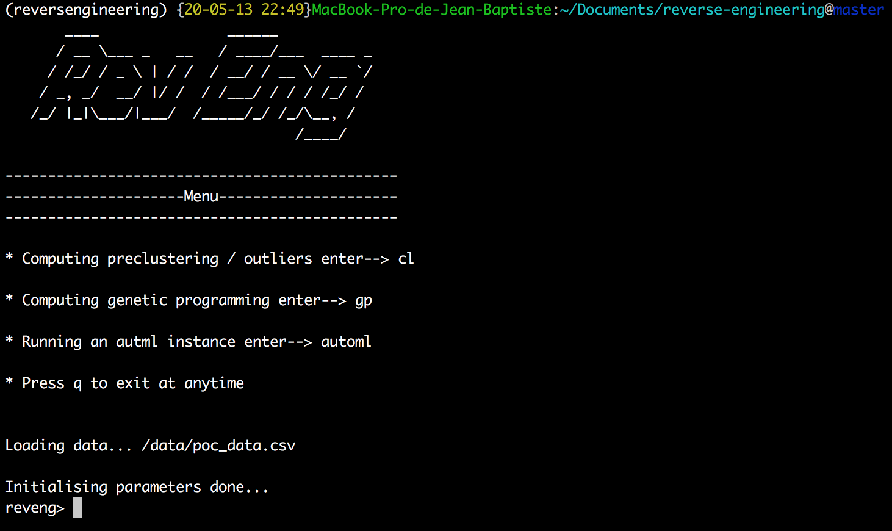

# RevEng - Machine Learning Reverse Engineering Tool

A comprehensive machine learning toolkit that combines AutoML, genetic programming, clustering, and model explainability features for advanced data analysis and model development.



## Repository Structure

```
reveng/
├── src/                   # Core modules
│   ├── automl.py          # H2O AutoML implementation
│   ├── explainautoml.py   # Model explainability with LIME
│   ├── geneticlearn.py    # Genetic programming using DEAP
│   ├── h2owrapper.py      # H2O wrapper utilities
│   ├── preclustering.py   # DBSCAN clustering and outlier detection
│   └── preprocessing.py   # Data preprocessing pipeline
├── utils/                 # Utility functions
├── config/                # Configuration files
├── data/                  # Sample datasets
├── __main__.py            # Main entry point
└── __init__.py            # Package initialization
```

## Usage

### Prelim

Configure your dataset in `config/config.json` (see [Configuration](#configuration) section)

### Running locally

```bash
python -m reveng
```

Available commands:
- `cl` - Compute preclustering and outlier detection
- `gp` - Run genetic programming
- `automl` - Execute AutoML pipeline
- `codb` - Connect to database
- `q` - Quit the application

## Features

- **AutoML Integration**: Automated machine learning using H2O framework with support for multiple algorithms (Random Forest, GLM, Deep Learning, GBM)
- **Genetic Programming**: Feature selection and model generation using DEAP (Distributed Evolutionary Algorithms in Python)
- **Clustering & Outlier Detection**: DBSCAN-based clustering with automatic outlier identification
- **Model Explainability**: LIME (Local Interpretable Model-agnostic Explanations) integration for model interpretability
- **Data Preprocessing**: Comprehensive preprocessing pipeline with encoding, scaling, and feature selection
- **Interactive CLI**: Command-line interface for easy interaction with all features
- **Configurable**: JSON-based configuration system for flexible dataset handling

### Configuration

Edit `config/config.json` to configure your dataset:

```json
{
  "your_dataset": {
    "path": "/data/your_file.csv",
    "target_output": "target_column_name",
    "exclude": ["target_column_name", "id_column"],
    "categorical_features": [0, 1, 4, 5],
    "inputing_features_gp": [3, 13, 14]
  },
  "automl_param": {
    "max_models": 10,
    "nfolds": 5,
    "seed": 42,
    "include_algos": ["DRF", "GLM", "DeepLearning", "GBM"]
  }
}
```

**Configuration Parameters:**
- `path`: Path to your CSV dataset
- `target_output`: Name of the target/output column
- `exclude`: List of columns to exclude from training (should include target column)
- `categorical_features`: List of column indices that contain categorical data
- `inputing_features_gp`: List of column indices to use for genetic programming
- `automl_param`: H2O AutoML configuration parameters


## Examples

### Basic AutoML Workflow

1. Configure your dataset in `config/config.json`
2. Run the application: `python -m reveng`
3. Execute AutoML: `automl`
4. View model performance and explanations

### Clustering Analysis

1. Run clustering: `cl`
2. View outlier detection results
3. Analyze cluster distributions

### Genetic Programming

1. Run genetic programming: `gp`
2. View evolved feature combinations
3. Analyze fitness scores

## Installation

### Prerequisites

- Python 3.7+
- Java 8+ (required for H2O)

### Dependencies

Install the required packages:

```bash
pip install h2o pandas numpy scikit-learn deap lime matplotlib pyfiglet
```

## License

This project is licensed under the MIT License - see the [LICENSE](LICENSE) file for details.

## Support

For issues and questions, please open an issue on the GitHub repository.


